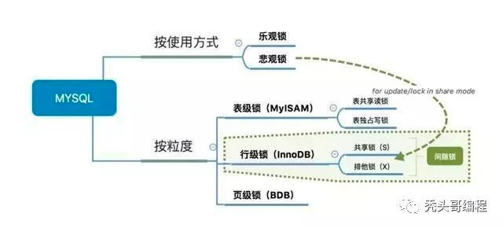

# mysql 相关
    - 关系型数据库。关系模型表明了数据库中所存储的数据之间的联系（一对一、一对多、多对多）
## 参考资料
- [JavaGuide-mysql](https://github.com/Snailclimb/JavaGuide/blob/master/docs/database/MySQL.md)
- [mysql-全面总结](https://cloud.tencent.com/developer/article/1803404?from=article.detail.1614355)
- [mysql-锁（全面总结）](https://cloud.tencent.com/developer/article/1614355)
- [mysql之锁总结](https://cloud.tencent.com/developer/article/1444243?from=article.detail.1584918)
## mysql基础
1. 启动服务：mysql.server start
2. 登录mysql：mysql -u root -p xxx
3. show databases; show engines;
4. 查看mysql当前默认存储引擎：show variables like '%storage_engine%';
5. 查看表的存储引擎：table status like "table_name" ;
6.

## 核心知识
#### mysql有哪些存储引擎？MyISAM 和 InnoDB的区别？
> 常见的存储引擎有MyISAM,InnoDB,MEMORY,MERGE.

MYISAM和InnoDB的区别：
- MYISAM 支持表级锁 innoDB支持表级锁和行级锁。
- M不支持事务 I支持事务；
- M不支持外键 I支持外键（一般不建议在数据层面做外键，代码层面也可以不过有数据一致性问题）
- M不支持数据异常崩溃后安全恢复，I支持；
- M不支持MVCC I支持（有点废话，mvcc是行级锁的升级，M本身不支持行级锁）
- M索引数据结构B数 I为B+树；M为非聚集索引 I为聚集索引；

其他：
- Memory存储引擎：支持的数据类型有限，不支持text和blob类型；默认使用hash索引，数据都放在内存中，访问速度快。
- Merge存储引擎：是一组MYISAM表的组合，本身没有数据，对其操作就是对内部MYISAM表的操作

### mysql锁
#### mysql相关锁
锁机制主要用于管理对共享资源并发访问。<br>
在数据库中lock和latch都称为锁，但是两者的意义不一样。
- latch：称为闩锁（shuang suo），其要求锁定的时间必须非常短。若持续的时间长，则应用的性能会非常差。
  <br>在InnoDB存储引擎中，latch又分为mutex互斥锁.
  
- lock：lock的对象是事务，用来锁定的是数据库中的对象，如表、页、行。并且一般lock的对象仅在事务commit或者rollback后进行释放。有死锁检测机制。

通过 ``show engine innodb mutex``可以查看InnoDB存储引擎的中latch


#### mysql Lock介绍


- 按照细粒度：
  - 表锁：开销小、加锁快、不会产生死锁；在表读锁和表写锁的环境下：读读不阻塞，读写阻塞，写写阻塞！
    - 表读锁
    - 表写锁
  - 行锁：开销大、加锁慢、会产生死锁；锁粒度小,锁冲突概率低,并发率高（有一下两种行锁模式）
    - 共享锁(s Lock):允许事务读取一行数据
    - 排它锁(x Lock):允许事务更新或删除一行数据
  > 1. 普通 select 语句默认不加锁，而CUD操作默认加排他锁
  > 2. 不同的存储引擎支持锁的力度不一样
  >   - myisam 支持表锁
  >   - InnoDB 支持表锁和行锁
  > 
  - 页面锁：开销，加锁，以及锁冲突介于表级锁和行级锁之间，会出现死锁

- 按照锁的使用方式（行锁)
  - 共享锁
  - 排他锁 - （悲观锁的一种实现）
  
- 两种思想上的锁
  - 乐观锁
  - 悲观锁
  
- InnoDB的几种行级锁类型（行锁的实现方式）：
  - Record Lock：对单行索引项加锁
  - Gap Lock：锁定一个范围，但不包含记录本身
    - 间隙锁只会在Repeatable read隔离级别下使用(关闭gap锁：将事务隔离级别变为read committed（事务降级）)
    - 使用间隙锁的目的：防止幻读。
    - eg：select * from user where id > 1 for update;
  - Next-key Lock：等于record lock + Gap lock;对记录的前后间隙加锁，包含记录本身
  
>注意: 
> 1. InnoDB只有通过索引条件检索数据才使用行级锁，否则，InnoDB将使用表锁。也就是说，InnoDB的行锁是基于索引的。
> 2. 临界锁next-key lock当查询的索引是唯一索引的时候，InnoDB会将临键锁优化成记录锁，从而提高并发.

#### 乐观锁和悲观锁?
无论是Read committed还是Repeatable read隔离级别，都是为了解决读写冲突的问题。乐观锁和悲观锁亦是。<br>
乐观锁：是一种思想，认为不会锁定的情况下去更新数据，如果发现不对劲，才不更新(回滚)。在数据库中往往添加一个version字段来实现。在更新时校验该字段的值是否和第一次查出来的一样。如果一样更新，反之拒绝。
<br>之所以叫乐观，因为这个模式没有从数据库加锁，等到更新的时候再判断是否可以更新。<br>
悲观锁：认为数据库会发生并发冲突，直接上来就把数据锁住，其他事务不能修改，直至提交了当前事务；是数据库层面加锁，都会阻塞去等待锁。如：for update。

#### mysql InnoDB MVCC是啥？实现原理？
- MVCC（多版本并发控制），又称为一致性非锁定读。指InnoDB通过行多版本控制的方式来读取当前数据库中行的数据。<br>
  > 在事务隔离界别read committed 和 repeatable read（InnoDB默认的事务隔离界别）下，InnoDB使用非锁定一致性读。
  > - 在read committed隔离级别下，非一致性读总是读取被锁定行的最新一份快照数据（如果没有被锁定，则读取行的最新数据；如果行锁定了，则读取该行的最新一个快照）。
  > - 在repeatable read事务隔离级别下，对于快照数据，非一致性读总是读取事务开始时的快照。
  - 优点：MVCC在大多数情况下代替了行锁，实现了对读的非阻塞，**读不加锁，读写不冲突**，极大的提高了读效率。
  - 缺点：每行记录都需要额外的存储空间，需要做更多的行维护和检查工作。
  - InnoDB中隐藏列：DB_TRX_ID（事务ID）、 DB_ROLL_PTR（回滚指针）、 DB_ROW_ID（行自增ID）；初始为null
- 实现原理:
  > 基于undo log实现。undo log本身是为回滚而用的。具体内容就是复制事务开始前的行到undo buffer，在适合的时间把undo buffer中的内容刷新到磁盘。<br>
  > undo log的简单工作过程：
  > - 开始事务
  > - 记录数据行数据备份到undo log
  > - 更新数据
  > - 将undo log写到磁盘
  > - 提交事务
  > 
> 注意：
> <br>undo log必须在数据持久化前持久化到磁盘，这样才能保证在系统崩溃时，可以使用undo log来回滚事务；
> <br>Innodb通过undo log保存了已更改行的旧版本的快照。
> <br>提交事务做的事情有：写redo log和binlog，并且把数据持久化到磁盘（可以通过参数控制）

- MVCC的sql规则
> MVCC只在READ COMMITTED 和 REPEATABLE READ 两个隔离级别下工作。READ UNCOMMITTED总是读取最新的数据行，而不是符合当前事务版本的数据行。而SERIALIZABLE 则会对所有读取的行都加锁。另外事务的版本号是递增的。
> - SELECT
> <br>InnoDB只查找行的事务ID 小于当前事务ID 的数据行（避免幻读）
> - INSERT
> <br>新插入的每一行保存当前事务ID作为行的事务ID
> - DELETE
> <br>删除的每一行保存当前事务ID作为行的事务ID
> - UPDATE
> <br>实际上是删除旧行，插入新行。
> <br>保存当前的事务ID作为新行的事务ID，同时保存当前事务ID到旧行的事务ID（上一个版本的事务ID即回滚ID）。

- 一致性锁定度（MVCC为一致性非锁定读）
> 1. 在默认的配置下，即事务的隔离级别为可重复度，InnoDB存储引擎的select操作使用一致性非锁定读（即MVCC）。但是在某些情况下，用户需要显示的对数据库读取操作进行加锁，以保证数据逻辑的一致性。而这要求数据库支持加锁语句，InnoDB存储引擎对select支持两种一致性的锁定读操作：
> ``` 
> select …  for update
> select … lock in share mode;
> select … for update 对读取的行记录加一个X锁，其他事务不能对已锁定的行加上任何锁。
> select…lock in share mode对读取的行记录加一个S锁，其他事务可以向被锁定的行加S锁，但是如果加X锁，则会被阻塞。
> ```
> 2. **对于一致性非锁定读，即时读取的行已经被执行了select…for update，也是可以进行读取的。**
> 3. select…for update或者select…lock in share mode必须在事务中，因为当事务提交了，锁也就释放了。从而避免锁没有释放，可能导致死锁的情况。
> 4. 如果不加筛选条件（或者筛选条件不走索引），会升级为表锁
> 5. 索引数据重复率太高会导致全表扫描：当表中索引字段数据重复率太高，则MySQL可能会忽略索引，进行全表扫描，此时使用表锁。可使用 force index 强制使用索引。
> 

### mysql事务
#### mysql的事务？事务的ACID特性？并发事务带来的问题以及解决（隔离级别）？事务的隔离级别？ 
- 事务是逻辑上的一组操作；要么都执行，要么都不执行。
- 四种特性：
    * 原子性
    * 一致性
    * 隔离性
    * 持久性
- 并发带来的问题：
    * 脏读：事务B读取并使用事务A正在修改但未提交的数据，最后A回滚了。
    * 丢失修改：事务A和事务B同时读到数据d，事务A修改提交数据d后；事务B也修改提交覆盖数据d，造成事务A数据修改的丢失。
    * 不可重复读：事务A在未提交前多次读取数据d，在此期间事务B（其他事务）读取并修改了数据d，导致事务A多次读取的数据d不一致。
    * 幻读：幻读和不可重复读类似。事务A读取几行数并准备更新期间，事务B插入了一行数据；导致事务A在结束后发现了还有一行数据未更新,感觉出现幻觉。
  > 注意：
  > * 不可重复读在于对单条数据的修改；幻读在于对数据的增删操作；
  > *
  
- 事务的隔离级别：
  * 读取未提交：最低隔离级别。会导致 脏读 不可重复读 幻读。
  * 读取已提交：允许读取并发事务已提交的数据；可以组织脏读，不可阻止不可重复读和幻读。
  * 可重复读：对同一个字段在一个事务里多次读取的结果是一致的；除非数据是本身事务所修改。可阻止脏读，不可重复读；但是幻读仍可能发生。
  * 串行化：最高的隔离级别，完全服从ACID的隔离级别，性能最差；所有事务串行化执行，可以避免脏读，不可重复读以及幻读。
  > 注意：
  > * Mysql InnoDB默认的隔离级别是 可重复读。查看隔离级别：``select @@tx_isolation;``
  > * 不过Mysql InnoDB 允许使用next-key lock（临键锁）锁算法来避免幻读的发生；
  > * 设置隔离级别：``set session transaction isolation level xxxx;``
  > * InnoDB实现的Repeatable read隔离级别配合GAP间隙锁已经避免了幻读！*

- 解决并发带来的问题：
  > 1. 适当根据实际业务需要提高事务的隔离级别。隔离级别越高，越能保证数据的完整性和一致性；但是对并发性能影响也越大。一般建议使用Read Committed来避免脏读，提高并发性能。
  > 2. 应用层可以结合乐观锁和悲观锁来解决脏读、不可重复读和幻读的问题。(排它锁)
  >

- 阻塞：事务因为等待其他事务释放锁而等待

- 超时：等待其他事务释放锁，超过超时时间，就认为是超时。innodb_lock_wait_timeout：用来控制超时时间，默认是50秒。

#### mysql死锁的产生和避免？
- 概念：死锁是指两个或者两个以上的事务，因争夺资源而造成的一种互相等待的现象。若无外力作用，所有事务都将无法推进下去。````

- 处理死锁
  - 1、FIFO处理死锁解决数据库死锁最简单的方法：设置超时时间。
  - 2、等待图：因为FIFO处理死锁可能不适用，所以数据库普遍采用了wait-for graph（等待图）的方式来进行死锁检测。和超时机制比较，这是一种更为主动的死锁检测方式，InnoDB也采用了这种方式。
     
     
  - 3、锁升级：比如行锁升级为表锁（或串行化），但是并发性能降低
- 减少或避免死锁  
  - 1. 以固定的顺序访问表和行：简单方法是对id列表先排序，后执行，这样就避免了交叉等待锁的情形；将两个事务的sql顺序调整为一致，也能避免死锁。 
  - 2. 大事务拆成小事务：大事务更倾向于死锁，如果业务允许，将大事务拆小。
  - 3. 在同一个事务中，尽可能做到一次锁定所需要的所有资源，减少死锁概率。
  - 4. 降低隔离级别。如果业务允许，将隔离级别调低也是较好的选择，比如将隔离级别从RR调整为RC，可以避免掉很多因为gap锁造成的死锁。
  - 5. 为表添加合理的索引。

#### 一般是怎么优化sql的？
- 通过show status了解各种sql的执行频率
  <br>Com_select 执行select的次数 
  <br>Com_update 执行update的次数
  <br>了解当前数据库是以更新插入为主还是以查询为主；了解各类型的sql比例
- 定位执行效率低的sql
  <br>通过慢查询定位执行效率低的sql
- 通过explain分析低效率sql执行计划
- 通过show profile分析sql
- 通过trace分析优化器如何选择执行计划

#### mysql一般有那几个分区？分别有啥作用？
mysql有四个分区类型；(TODO)
- RANGE分区
- List分区
- Hash分区
- Key分区

## mysql索引相关
#### 什么是索引？索引优缺点？mysql目前支持哪些索引？

- 什么是索引：索引是一种用于快速查询和检索数据的数据结构。
  它是一种特殊的文件(InnoDB数据表上的索引是表空间的一个组成部分)，它们包含着对数据表里所有记录的引用指针。 好比一本书的目录。加快数据库查询速度。

- 优点：
  - 使用索引可以大大加快数据的检索速度（大大减少检索的数据量）, 这也是创建索引的最主要的原因。
  - 通过创建唯一性索引，可以保证数据库表中每一行数据的唯一性。
  - 索引可以帮助服务器避免排序和临时表。（B+Tree索引是有序的，可以用于 ORDER BY 和 GROUP BY 操作。临时表主要是在排序和分组过程中创建，因为不需要排序和分组，也就不需要创建临时表）
  - 将随机 I/O 变为顺序 I/O（B+Tree 索引是有序的，会将相邻的数据都存储在一起）
  - 索引对于InnoDB（对索引支持行级锁）非常重要。
- 缺点：
  - 创建索引和维护索引需要耗费许多时间。当对表中的数据进行增删改的时候，如果数据有索引，那么索引也需要动态的修改，会降低 SQL 执行效率。
  - 索引需要使用物理文件存储，也会耗费一定空间。在大表上创建了多种组合索引，索引文件的会膨胀很快。
  - 并不是所有索引查询比全表扫描更快，对于非常小的表，大部分情况下简单的全表扫描更高效。

- mysql支持的索引：
1. B+tree和B-tree索引，最常见的索引类型，innoDB默认B+tree索引
   - 由搜索引擎的不同可分为：
     - InnoDB 聚簇索引（聚集索引）按照数据存放的物理位置为顺序的， 能提高多行检索的速度
     - MYISAM 非聚簇索引（非聚集索引）不是按照数据存放的物理位置为顺序的 MYISAM 对于单行的检索很快
2. Hash索引，只有Memory引擎支持，适用于key-value查询,使用场景简单，不支持范围查询
   - 哈希索引能以 O(1) 时间进行查找，但是失去了有序性：
      - 无法用于排序和分组
      - 只支持精确查找，无法用于部分查找和范围查找
   - InnoDB 存储引擎有一个特殊的功能叫“自适应哈希索引”，当某个索引值被使用的非常频繁时，会在 B+Tree 索引之上再创建一个哈希索引，这样就让 B+Tree 索引具有哈希索引的一些优点，比如快速的哈希查找。
4. R-tree,空间索引，是myisam的一个特殊索引类型，主要用于地理空间数据类型
   - MyISAM 存储引擎支持空间数据索引（R-Tree），可以用于地理数据存储。空间数据索引会从所有维度来索引数据，可以有效地使用任意维度来进行组合查询
   - 必须使用 GIS 相关的函数来维护数据。
5. full-text,全文索引，是myisam的一个特殊索引类型，主要用于全文索引
    - MyISAM 存储引擎支持全文索引，用于查找文本中的关键词，而不是直接比较是否相等。
    - 查找条件使用 MATCH AGAINST，而不是普通的 WHERE。
    - 全文索引使用倒排索引实现，它记录着关键词到其所在文档的映射。
    - InnoDB 存储引擎在 MySQL 5.6.4 版本中也开始支持全文索引。 
  

#### mysql索引底层数据结构？B数和B+树？
- [mysql底层数据结构](https://www.jianshu.com/p/1775b4ff123a)
- 
#### mysql索引类型？如何创建使用索引？索引的设计和使用建议？
 - [参考](https://zhuanlan.zhihu.com/p/29118331)
1. 索引类型：
  - 主键索引
  - 辅助索引（二级索引）
  - 聚集索引和非聚集索引
  - 覆盖索引
2. 如何创建索引

  - 添加PRIMARY KEY（主键索引） 
    <br>``ALTER TABLE `table_name` ADD PRIMARY KEY ( `column` )``
  - 添加UNIQUE(唯一索引)
    <br>``ALTER TABLE `table_name` ADD UNIQUE ( `column` )``
  - 添加INDEX(普通索引)
    <br>``ALTER TABLE `table_name` ADD INDEX index_name ( `column` )``
  - 添加FULLTEXT(全文索引)
    <br>``ALTER TABLE `table_name` ADD FULLTEXT ( `column`)``
  - 添加多列索引（组合索引）最左原则
    <br>``ALTER TABLE `table_name` ADD INDEX index_name ( `column1`, `column2`, `column3` )``
    
3. （B树）索引的设计
  - 索引字段尽量使用数字型
  - 尽量不用让字段默认为NULL
  - 前缀索引和索引选择性
    - 对于BLOB、TEXT或者很长的VARCHAR类型的列，必须使用前缀索引，因为MYSQL不允许索引这些列的完整长度。
    - 前缀索引是一种能使索引更小、更快的有效办法，但另一方面也有其缺点：MySQL无法使用前缀索引做order by和group by，也无法使用前缀索引做覆盖扫描。
    - 尽量选择区分度高的列作为索引,区分度的公式是count(distinct col)/count(*) 表示字段不重复比例，唯一键区分度为1。
  - 使用唯一索引
  - 使用组合索引代替多个列索引；尽量的扩展索引，不要新建索引。
  - 注意重复/冗余的索引、不使用的索引
  - =和in可以乱序
  
4. （B树）索引的使用和注意
  - 如果对大的文本进行搜索，使用全文索引而不要用使用 like ‘%…%’
  - 索引字段的like语句不要以通配符开头
  - 不要在索引列上进行运算
  - 尽量不要使用NOT IN、<>、!= 操作；否则将引擎放弃使用索引而进行全表扫描。
  - or条件：用 or 分割开的条件， 如果 or 前的条件中的列有索引， 而后面的列中没有索引， 那么涉及到的索引都不会被用到。
  - 组合索引的使用要遵守“最左前缀”原则'
  - 使用索引排序时，ORDER BY也要遵守“最左前缀”原则
  - 如果列类型是字符串，那么一定记得在 where 条件中把字符常量值用引号引起来，否则的话即便这个列上有索引，MySQL 也不会用到的，因为MySQL 默认把输入的常量值进行转换以后才进行检索。
  - MySQL查询只使用一个索引，因此如果where子句中已经使用了索引的话，那么order by中的列是不会使用索引的。
  - 如果 MySQL 估计使用索引比全表扫描更慢，则不使用索引。当索引列有大量数据重复时,查询可能不会去利用索引。


5. 索引失效有哪些场景
    1. 以%开头的like查询不能够利用B-tree索引
    2. 数据类型出现隐式转换的时候不会使用索引
    3. 复合索引情况下，假设查询条件不包含索引列最左边部分
    4. 如果mysql认为使用索引比全表扫描更慢，则不是用索引
    5. 用OR分割开的条件，如果or前的条件的列有索引,而后面列中没有索引，不会使用索引
  
6. mysql的两种排序方式
   - 使用fileSort：通过对返回的数据进行排序，也就是fileSort排序,所有不是通过索引排序直接返回的都叫fileSort。
     > 
     > 当MySQL不能使用索引进行排序时，就会利用自己的排序算法(快速排序算法)在内存(sort buffer)中对数据进行排序;  
     如果内存装载不下，它会将磁盘上的数据进行分块，再对各个数据块进行排序，然后将各个块合并成有序的结果集（实际上就是外排序，使用临时表）;  
     fileSort的两种排序算法:
     > - 两次扫描算法：先将需要排序的字段和可以直接定位到相关行数据的指针信息取出，然后在设定的内存（通过参数sort_buffer_size设定）中进行排序，完成排序之后再次通过行指针信息取出所需的Columns。  
         该算法是MySQL4.1之前采用的算法，它需要两次访问数据，尤其是第二次读取操作会导致大量的随机I/O操作。另一方面，内存开销较小。
     > - 一次扫描算法：该算法一次性将所需的Columns全部取出，在内存中排序后直接将结果输出。  
         从MySQL4.1版本开始使用该算法。它减少了I/O的次数，效率较高，但是内存开销也较大。如果我们将并不需要的Columns也取出来，就会极大地浪费排序过程所需要的内存。
     
        >算法选择：可以通过设置 max_length_for_sort_data 参数来控制 MySQL 选择第一种排序算法还是第二种：当取出的所有大字段总大小大于 max_length_for_sort_data 的设置时，MySQL 就会选择使用第一种排序算法，反之，则会选择第二种。  
        为了尽可能地提高排序性能，我们自然更希望使用第二种排序算法，所以在 Query 中仅仅取出需要的 Columns 是非常有必要的。
   - 按索引顺序扫描：通过有序索引顺序扫描直接返回有序数据,explain分析语句之后显示Using index。

#### Mysql bin log、undo log、redo log作用和区别

#### 一条查询语句的执行顺序？

## 线上问题

#### 线上大表DDL如何操作（大表加索引，新增字段）？
#### 分布式事务解决方案？
#### mysql大表优化方案？
    